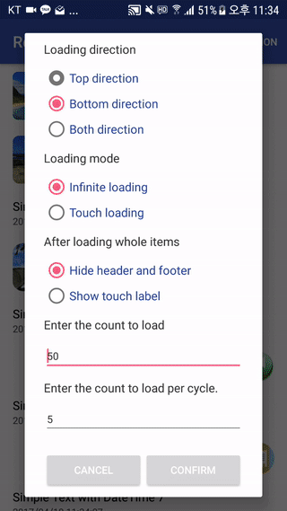
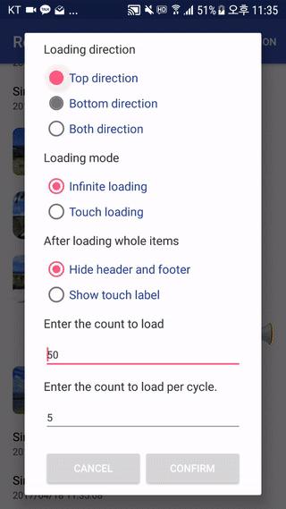
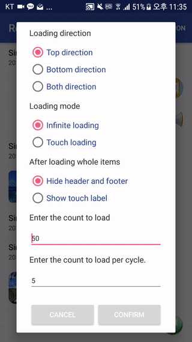
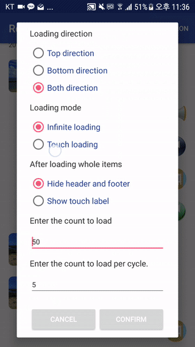
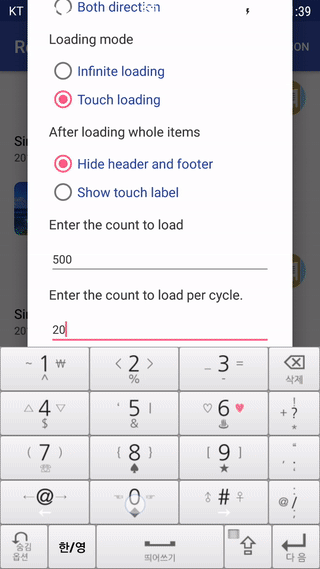

<h1 align="center">RecyclerView Life</h1>

<p align="center">
  <a href="http://developer.android.com/index.html"></a>
  <a href="https://android-arsenal.com/api?level=14"></a>
  <a href="https://github.com/allsoft777/RecyclerViewLife/blob/master/LICENSE"></a>
</p>

RecyclerView를 활용하여 리스트뷰를 구현할때 사용되는 많은 Framework Api를 캡슐화 시키고 다양한 ViewBinder의 관리를 쉽게 할 수 있도록 편의 기능을 제공한다. 또한 Infinite Scrolling을 지원하는 별도의 Listener 구현체를 제공하고 HeaderView와 FooterView도 하나의 리스트 타입으로 제공해주고 있습니다. 해당 Listener를 통하여 자동으로 데이터를 로드할 수 있고 이를 HeaderView 또는 FooterView에(이하 HF) 진행 상황을 표시할 수 있으며 모두 커스텀하게 ViewBinder를 구현 할 수 있다.
<br>

## Screenshot
__

__



<br>

* <a href="#build_setting">Build Settings</a>
* <a href="#simple_listview">Simple ListView 구현</a>
	* <a href="#simple_listview_model">Model(entity class)</a>
	* <a href="#simple_listview_viewbinder">ViewBinder</a>
	* <a href="#simple_listview_adapter">RecyclerListViewAdapter</a>
	* <a href="#simple_listview_caller">Caller (client layer)</a>
* <a href="#scrolling">스크롤시 데이터 자동 로드</a>
	* <a href="#fh_entity_class">FH Model(entity class)</a>
	* <a href="#fh_viewbinder">ViewBinder</a>
	* <a href="#fh_adapter">RecyclerListViewAdapter</a>
	* <a href="#fh_caller">Caller (client layer)</a>
	* <a href="#fh_scroll_listener">Scroll Listener</a>
* <a href="#fh_adapter_api">LinearListViewAdapter api</a>
<br>

Usage
-----

<a id="build_setting"></a>
### 1. Build Settings

##### Gradle
```groovy
dependencies {
    compile 'com.seongil:recyclerviewlife:1.0.2'
}
```
##### Maven
```xml
<dependency>
    <groupId>com.seongil</groupId>
    <artifactId>recyclerviewlife</artifactId>
    <version>1.0.2</version>
    <type>pom</type>
</dependency>
```
<br>
<a id="simple_listview"></a>

### 2. Simple ListView 구현

<a id="simple_listview_model"></a>
#### 2.1 Model(entity class) 정의

모든 모델(entity class)는 [RecyclerViewItem](https://github.com/allsoft777/RecyclerViewLife/blob/master/recyclerviewlife/src/main/java/com/seongil/recyclerviewlife/model/common/RecyclerViewItem.java) 인터페이스를 구현해야만 한다. RecyclerViewItem은 아무 데이터를 가지고 있지 않은 인터페이스이고 라이브러리 내부적으로 타입을 판단하기 위하여 사용된다.
```java
public class TitleDateItem implements RecyclerViewItem {

    private String title;
    private String dateTime;

	// ... 중략
}
```
<a id="simple_listview_viewbinder"></a>
#### 2.2 ViewBinder 구현

각 모델을 화면에 rendering하는 ViewBinder를 구현하기 위하여 AbstractViewBinder 를 상속받아서 구현체를 만들고 내부적으로 해당 view에 해당하는 ViewHolder를 구현한다.

```java
public class LinearListTwoTextViewBinder extends AbstractViewBinder {

    public LinearListTwoTextViewBinder(int viewType, @NonNull LayoutInflater inflater,
          @Nullable RecyclerViewItemClickListener itemClickListener) {
        super(viewType, inflater, itemClickListener);
    }

    @Override
    public boolean isForViewType(@NonNull RecyclerViewItem item) {
        return item instanceof TitleDateItem;
    }

    @Override
    public RecyclerView.ViewHolder onCreateViewHolder(ViewGroup parent) {
        return new TwoTextViewHolder(
              mLayoutInflater.inflate(R.layout.linearlistview_item_with_two_text, parent, false));
    }

    @Override
    public void onBindViewHolder(@NonNull RecyclerViewItem item, @NonNull RecyclerView.ViewHolder holder) {
        final TitleDateItem data = (TitleDateItem) item;
        final TwoTextViewHolder viewHolder = (TwoTextViewHolder) holder;
        viewHolder.itemView.setOnClickListener(v -> {
            if (mItemViewClickListener != null) {
                mItemViewClickListener.onClickedRecyclerViewItem(holder, data, viewHolder.getLayoutPosition());
            }
        });
        viewHolder.title.setText(data.getTitle());
        viewHolder.dateTime.setText(data.getDateTime());
    }

    public static class TwoTextViewHolder extends RecyclerView.ViewHolder {

        public final TextView title;
        public final TextView dateTime;

        public TwoTextViewHolder(View view) {
            super(view);
            title = (TextView) view.findViewById(R.id.primary_text);
            dateTime = (TextView) view.findViewById(R.id.secondary_text);
        }
    }
}
```
<a id="simple_listview_adapter"></a>
#### 2.3 RecyclerListViewAdapter 구현

ViewBinder를 관리하고 data set을 관리하는 Adapter를 구현하자. RecyclerListViewAdapter를 상속 받아서 구현체를 만들고, FH가 필요 하면 필요한 각 메서드를 오버라이딩하면된다. 하기 샘플 코드는 일반적으로 사용되는 listview 에서 3가지의 타입을 지원하는 코드를 나타내고 FH의 구현에 대해서는 3번 section을 참고하자.
```java
public class LinearListViewAdapter extends RecyclerListViewAdapter {

    private static final int VIEW_TYPE_TITLE_DATE = 1;
    private static final int VIEW_TYPE_THUMBNAIL_TITLE = 2;
    private static final int VIEW_TYPE_ADVERTISEMENT = 3;

    public LinearListViewAdapter(
          @NonNull LayoutInflater layoutInflater,
          @Nullable RecyclerViewItemClickListener viewItemClickListener) {
        super(layoutInflater);
        addViewBinder(
              new LinearListTwoTextViewBinder(
                    VIEW_TYPE_TITLE_DATE, layoutInflater, viewItemClickListener));
        addViewBinder(
              new LinearListThumbnailTextViewBinder(
                    VIEW_TYPE_THUMBNAIL_TITLE, layoutInflater, viewItemClickListener));
        addViewBinder(
              new LinearListAdvertisementViewBinder(
                    VIEW_TYPE_ADVERTISEMENT, layoutInflater, viewItemClickListener));
    }
}
```
<a id="simple_listview_caller"></a>
#### 2.4 Client Layer (caller 구현)

Caller(Activity, Fragment, etc...)에서 사용할 때에는 기존에 사용하던 기본 코드의 틀에서 크게 벗어나지 않는다.
```java
        LinearListViewAdapter adapter = new LinearListViewAdapter(
              getActivity().getLayoutInflater(), this);
        RecyclerView listview = // Assign a listview.
        listview.setAdapter(adapter);
```
<br>
<a id="scrolling"></a>

### 3. 스크롤시 데이터 자동 로드 및 FH(FooterView, HeaderView) 구현

스크롤을 했을때 데이터를 자동으로 로드 하는 기능 및 사용자가 FH를 터치 했을 때에만 로드 할 수 있는 기능을 지원한다. 앞으로 보여질 데이터가 몇개 미만으로 남았을때 자동으로 로드 할 수 있게끔 별도의 threshold값을 제공하고 개발자는 이를 설정 할 수도 있다. FH에서는 기본적으로 현재의 로드 상황을 보여주는 기능을 하지만 얼마든지 커스텀한 뷰로 확장 할 수 있다.
<a id="fh_entity_class"></a>
#### 3.1 FH에서 사용하는 Entity Class(Model) 정의

해당 라이브러리를 사용하기 위하여 기본 모델은 RecyclerViewItem 인터페이스를 구현해야 하지만, FH는 RecyclerViewFooterItem, RecyclerViewHeaderItem을 상속받아서 구현해야 한다. 물론 별도의 entity data가 필요 없다면 구현할 필요 없이 RecyclerViewFooterItem, RecyclerViewHeaderItem을 그대로 사용하면 된다. 구현이 필요할 경우에는 하기 코드처럼 상속받아서 구현하도록 하자.
```java
public class ClientFooterItem extends RecyclerViewFooterItem {

    private int data1;
    private int data2;

	public ClientFooterItem() {
        super(ViewStatus.VISIBLE_LOADING_VIEW);
    }

    public ClientFooterItem(ViewStatus requestCode) {
        super(requestCode);
    }

    // ... 중략
}

public class ClientHeaderItem extends RecyclerViewHeaderItem {

    private int data1;
    private int data2;

	public ClientHeaderItem() {
        super(ViewStatus.VISIBLE_LOADING_VIEW);
    }

    public ClientHeaderItem(ViewStatus requestCode) {
        super(requestCode);
    }

    // ... 중략
}

```

ViewState는 FH의 상태를 나타내는 값으로서, 하단 3.2 ViewBinder에서 부연설명을 참고하자.
<a id="fh_viewbinder"></a>
#### 3.2 ViewBinder 구현

FooterViewBinder의 구현부를 살펴보자. 현재의 로드 상태에 따라서 서로 다른 뷰를 보여주는 기능을 한다. 나머지 코드는 위쪽에 설명한 ViewBinder 구현부와 유사하므로 뷰 상태 값에 따라서 처리하는 onBindViewHolder() 메서드만 살펴보자. 전체 코드는 sample app을 참고하도록 하자.
```java
    @Override
    public void onBindViewHolder(@NonNull RecyclerViewItem item, @NonNull RecyclerView.ViewHolder holder) {
        final ClientFooterItem data = (ClientFooterItem) item;
        final HeaderViewHolder viewHolder = (HeaderViewHolder) holder;
        final Resources res = holder.itemView.getResources();
        final ViewStatus code = data.getStatusCode();
        if (code == ViewStatus.HIDE_VIEW) {
            viewHolder.itemView.setVisibility(View.GONE);
        } else if (code == ViewStatus.VISIBLE_LOADING_VIEW) {
            viewHolder.itemView.setVisibility(View.VISIBLE);
            viewHolder.container.setClickable(false);
            viewHolder.container.setFocusable(false);
            viewHolder.message.setText(res.getString(R.string.loading));
            viewHolder.message.setVisibility(View.VISIBLE);
            viewHolder.progressBar.setVisibility(View.VISIBLE);
            viewHolder.itemView.setOnClickListener(null);
        } else if (code == ViewStatus.VISIBLE_LABEL_VIEW) {
            viewHolder.itemView.setVisibility(View.VISIBLE);
            viewHolder.container.setClickable(true);
            viewHolder.container.setFocusable(true);
            viewHolder.message.setText(res.getString(R.string.touch_to_load_previous_data));
            viewHolder.message.setVisibility(View.VISIBLE);
            viewHolder.progressBar.setVisibility(View.GONE);
            viewHolder.itemView.setOnClickListener(v -> {
                if (mItemViewClickListener != null) {
                    mItemViewClickListener.onClickedRecyclerViewItem(holder, data, viewHolder.getLayoutPosition());
                }
            });
        }
    }
```

뷰 상태는 크게 3가지를 제공한다. HIDE_VIEW는 로드가 끝나거나 더이상 로드할 데이터가 없는 경우에 불려질수 있다. 샘플 코드에서는 뷰 전체를 hide시키고 있다. VISIBLE_LOADING_VIEW는 현재 데이터를 로드 하고 있는 상태를 의미하고 샘플 코드에서는 이를 나타내는 화면을 rendering하고 있다. 또 다른 상태값으로 VISIBLE_LABEL_VIEW가 있는데 이는 항상 화면에 보여지고 있는 상태를 의미한다. 샘플코드에서는 이 상태값일때 사용자가 터치를 통하여 데이터를 로드 할 수 있도록 하고 있다. 사용자의 선택에 의하여 데이터를 로드할 수 있는 옵션을 제공 해 주고자 한다면 VISIBLE_LABEL_VIEW 상태값을 사용하면 될 것이다.
<a id="fh_adapter"></a>
#### 3.3 RecyclerListViewAdapter 구현

Adapter 구현부는 섹션 2.3 에서 추가적으로 FH를 지원하기 위한 관련 메서드를 오버라이딩 하면 된다.

#### 3.3.1 HeaderView만 제공하는 경우

FooterView만 지원하는 경우도 하기 코드와 유사한다.

```java
public class LinearListViewAdapter extends RecyclerListViewAdapter {

    @Nullable
    private RecyclerViewItemClickListener mViewItemClickListener;

    public LinearListViewAdapter(
          @NonNull LayoutInflater layoutInflater,
          @Nullable RecyclerViewItemClickListener viewItemClickListener) {
        super(layoutInflater);
        mViewItemClickListener = viewItemClickListener;
    }

    @Override
    protected AbstractHeaderViewBinder getNewInstanceOfHeaderViewBinder() {
        return new LinearListHeaderViewBinder(mLayoutInflater, mViewItemClickListener);
    }

    @Override
    protected ClientHeaderItem getNewInstanceOfHeaderItem() {
        return new ClientHeaderItem(ViewStatus.VISIBLE_LOADING_VIEW);
        // return new ClientHeaderItem(ViewStatus.VISIBLE_LABEL_VIEW);
    }

    // ... 중략
}
```

#### 3.3.2 FH 모두 제공하는 경우
```java
public class LinearListViewAdapter extends RecyclerListViewAdapter {

    @Nullable
    private RecyclerViewItemClickListener mViewItemClickListener;

    public LinearListViewAdapter(
          @NonNull LayoutInflater layoutInflater,
          @Nullable RecyclerViewItemClickListener viewItemClickListener) {
        super(layoutInflater);
        mViewItemClickListener = viewItemClickListener;
    }

    @Override
    protected AbstractHeaderViewBinder getNewInstanceOfHeaderViewBinder() {
        return new LinearListHeaderViewBinder(mLayoutInflater, mViewItemClickListener);
    }

    @Override
    protected ClientHeaderItem getNewInstanceOfHeaderItem() {
        return new ClientHeaderItem(ViewStatus.VISIBLE_LOADING_VIEW);
        // return new ClientHeaderItem(ViewStatus.VISIBLE_LABEL_VIEW);
    }

    @Override
    protected AbstractFooterViewBinder getNewInstanceOfFooterViewBinder() {
        return new LinearListFooterViewBinder(mLayoutInflater, mViewItemClickListener);
    }

    @Override
    protected ClientFooterItem getNewInstanceOfFooterItem() {
        return new ClientFooterItem(ViewStatus.VISIBLE_LOADING_VIEW);
        // return new ClientFooterItem(ViewStatus.VISIBLE_LABEL_VIEW);
    }

    // ... 중략
}

```
<a id="fh_caller"></a>

#### 3.4 Client Layer (caller 구현)

RecyclerView를 configuration하는 caller쪽에서 어떻게 사용하는지 하기 코드를 살펴보자.

#### 3.4.1 HeaderView만 제공하는 경우
```java
    LinearListViewAdapter adapter = LinearListViewAdapter(getActivity().getLayoutInflater(), this);
    mAdapter.registerHeaderView();
    RecyclerView listview = // Assign a listview.
    listview.setAdapter(adapter);
```

#### 3.4.2 FooterViw만 제공하는 경우

```java
    LinearListViewAdapter adapter = LinearListViewAdapter(getActivity().getLayoutInflater(), this);
    mAdapter.registerFooterView();
    RecyclerView listview = // Assign a listview.
    listview.setAdapter(adapter);
```

#### 3.4.3 FH 둘다 제공하는 경우
```java
    LinearListViewAdapter adapter = LinearListViewAdapter(getActivity().getLayoutInflater(), this);
    mAdapter.registerHeaderView();
    mAdapter.registerFooterView();
    RecyclerView listview = // Assign a listview.
    listview.setAdapter(adapter);
```
<a id="fh_scroll_listener"></a>

#### 3.5 LinearRecyclerViewScrollListener 구현
"Auto Load More"를 지원하기 위하여 LinearRecyclerViewScrollListener 을 구현한다. 자세한 구현 샘플코드는 [LinearListViewFragment](https://github.com/allsoft777/RecyclerViewLife/blob/master/app/src/main/java/com/seongil/recyclerviewlife/sample/ui/linearlistview/LinearListViewFragment.java) 을 참고바란다.

| api | 설명 |
| :--- |:--- |
|void setAutoLoadingThreshold(int threshold) | 몇개의 항목이 남았을때 데이터를 로드 할 것인지를 나타내는 값으로서 기본값은 5개이다. |
|void loadItemsMoreForcibly()                | 스크롤의 상태와는 관련없이 강제로 데이터를 로딩하는 기능을 한다. <br>보통 최초에 데이터를 로드하거나 SwipeRefreshLayout를 이용하여 리스트뷰를 refresh할때 사용된다. |

<br>
<a id="fh_adapter_api"></a>

### 4. LinearListViewAdapter api

| api | 설명 |
| :--- |:--- |
| void setNotifyObservers(boolean mNotifyObservers)| Data가 변경되었을때 등록된 observer들에게 통지 할 것 인지를 설정하기 위한 api |
| List<T> getDataSet() | adapter가 가지고 있는 DataSet을 반환한다. |
| void setData(List<T> collection) | adapter의 DataSet을 인자와 교체한다. |
| public void clearDataSet() | adapter의 DataSet을 clear한다. |
| void addFirstCollection(List<T> collection) | adapter가 가지고 있는 DataSet의 앞쪽에 list를 추가한다. |
| public void addFirst(T element) | adapter가 가지고 있는 DataSet의 앞쪽에 element를 추가한다. |
| void addLastCollection(List<T> collection) | adapter가 가지고 있는 DataSet의 마지막에 list를 추가한다. |
| void addLast(T element) | adapter가 가지고 있는 DataSet의 마지막에 element를 추가한다. |
| void addPosition(T element, int position) | adapter가 가지고 있는 DataSet의 position 위치에 element를 추가한다. |
| void removeLastItem() | adapter가 가지고 있는 DataSet의 마지막 항목을 삭제한다. |
| void removeFirstItem() | adapter가 가지고 있는 DataSet의 첫번째 항목을 삭제한다. |
| void updatePositionWithNotify(T element, int position) | setNotifyObservers를 통하여 notifyObservers가 false로 assign 되어 있더라도<br> 이 api를 통하여 특정 position의 element를 업데이트하고 등록된 observer에 통지한다. |
| void replaceElement(int position, T element) | adapter가 가지고 있는 DataSet의 position에 있는 항목을 element로 교체한다.<br> 등록된 observer에 통지하지는 않는다. |
| RecyclerViewHeaderItem getHeaderItem() | adapter가 가지고 있는 DataSet의 header item을 반환한다. |
| RecyclerViewFooterItem getFooterItem() | adapter가 가지고 있는 DataSet의 footer item을 반환한다. |
| void replaceHeaderItem(T element) | adapter가 가지고 있는 DataSet의 header item을 교체한다. |
| void replaceFooterItem(T element) | adapter가 가지고 있는 DataSet의 footer item을 교체한다. |
| T getItem(int position) | adapter가 가지고 있는 DataSet의 position 위치에 있는 항목을 반환한다. |


License
-------

    Copyright (C) 2017 Seongil Kim

    Licensed under the Apache License, Version 2.0 (the "License");
    you may not use this file except in compliance with the License.
    You may obtain a copy of the License at

       http://www.apache.org/licenses/LICENSE-2.0

    Unless required by applicable law or agreed to in writing, software
    distributed under the License is distributed on an "AS IS" BASIS,
    WITHOUT WARRANTIES OR CONDITIONS OF ANY KIND, either express or implied.
    See the License for the specific language governing permissions and
    limitations under the License.
